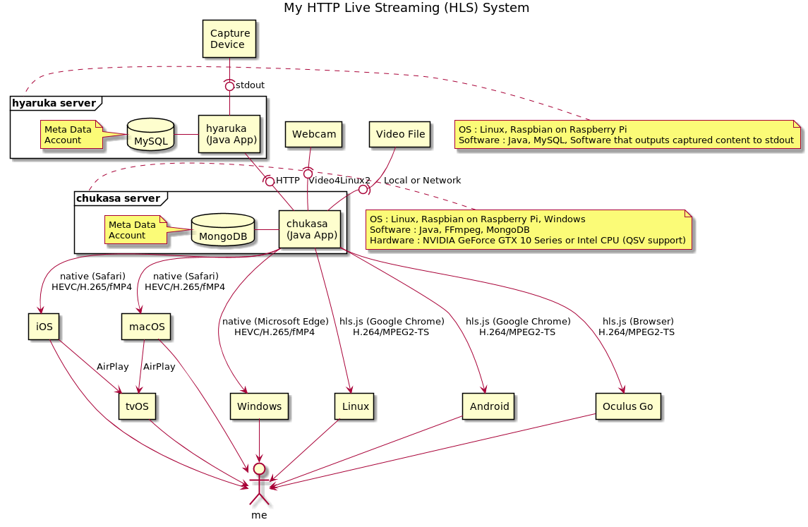

# chukasa 

 

HTTP Live Streaming (HLS) server that distributes...

- video file on demand
- live stream of webcam
- live stream of capture device (with [hyaruka](https://github.com/hirooka/hyaruka))
- captured video file by okkake

to cross-platform.

And it records stream of capture device by scheduler. (EXPERIMENTAL)

## Server

### Ubuntu 18.04 (with NVENC)

#### Software & Hardware required

- Java 10
- FFmpeg 4.0
- MongoDB 3.6
- NVIDIA Geforce GTX 10 Series

#### Confirmed environment

- MSI GeForce GTX 1050 2GT LP

#### Construction procedure

- [just for reference](docs/procedure/ubuntu_18_04.txt)

### CentOS 7.4 (with QSV)

#### Software & Hardware required

- Java 10
- FFmpeg 4.0
- MongoDB 3.6
- Intel Media Server Studio 2018 R1
- Intel CPU

#### Confirmed environment

- Intel Core i3-6100

#### Construction procedure

- TBD

### Windows 10 (with QSV)

#### Software & Hardware required

- Java 10
- FFmpeg 4.0
- MongoDB 4.0
- Intel CPU

#### Confirmed environment

- Diginnos Stick DG-STK4D (Intel Atom x5-Z8550)

#### Construction procedure

- [just for reference](docs/procedure/windows_10.txt)

### Raspbian Stretch (with OpenMAX)

#### Software & Hardware required

- Java 9
- FFmpeg 4.0
- MongoDB 3.0
- Raspberry Pi 3 Model B

#### Confirmed environment

- Raspberry Pi 3 Model B

#### Construction procedure

- [just for reference](docs/procedure/raspberry_pi_3_model_b.txt)

### macOS (with TBD)

#### Software & Hardware required

- Java 10
- FFmpeg 4.0
- MongoDB 3.0

#### Confirmed environment

- TBD

#### Construction procedure

- TBD

## Client

#### Confirmed device

- iOS (Safari on iPhone, iPad, iPod)
- macOS (Safari)
- tvOS (via AirPlay from iOS or macOS)
- Windows 10 (Microsoft Edge)
- Android (Google Chrome)
- Oculus Go (Browser)